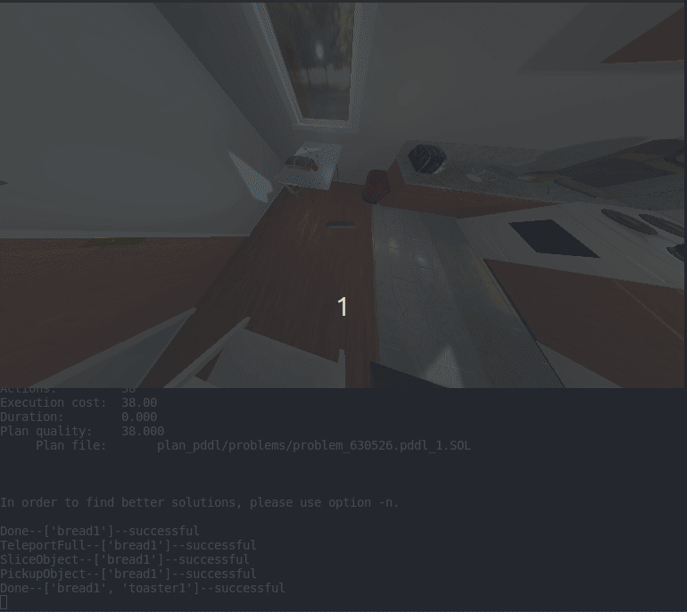

# RoboChef -  Planning in a Kitchen Environment

PDDL planinng for 'AI2Thor' kitchen environments.

## Introduction
Model-based planning is a prominent aspect of artificial intelligence, where robots are taking place in more and more daily jobs which require abstract reasoning to make the agent work logically and efficiently as much as possible. Therefore, agent/s environments usually utilize task and motion planning prior to executing a set of actions, depending on the world and the constraints that are present. One possible example of a daily job environment is the kitchen. One has to plan his set of actions in order to accomplish a task (cooking, washing dishes, heating, setting a tabe, etc.).

**RoboChef** combines techniques AI planning enigine and the [*AI2Thor*](https://ai2thor.allenai.org/)  (© The Allen Institute for AI) simulation environment with the aim of simply and efficiently execute a task in the kitchen by planning in advance. The robot's main task is to move around different kinds of foods and tools, interact with them in the manner of cooking, toggling, cleaning etc., and possiblly serve them.
The code is mainly written in Python, and contains several parts in PDDL. This projects integrates knowledge and functionality from different fields as planning, templating engines, high-level programming and scripting, aiming to create a smooth process of planning and execution. 

## How to use RoboChef

First, a** Colab notebook** has been written in order to reproduce a useful demonstartion of RoboChef.
the notebook, which can be run on any machine that's connected to the web, can be found [here](https://colab.research.google.com/drive/1ho-44hpmA01WkJTlxAuwVJ_RvlaczfwW?usp=sharing). If you'd like to modify or test different use cases in the code, please follow the next sections.

### Requirements

| Component  | Requirement  | 
|---|---|
|   OS |   **Ubuntu 14.04+**|  
|   Graphics Card|  	DX9 (shader model 3.0) or DX11 with feature level 9.3 capabilities. | 
| CPU | 	SSE2 instruction set support |
|Pyhton Version | 3.5+ |
| pip Version | 19.3+ |

### Installation

Simply install the following packages:

**AI2THOR**

	pip install ai2thor

or

	conda install -c conda-forge ai2thor

**Jinja2**

	pip install Jinja2

Finally, clone the project folder to a local directory:

	git clone https://github.com/roymatza/Robochef

### Initilization

**Initializing AI2Thor Controller**

Create an AI2Thor controller to activate the environment:

		from ai2thor.controller import Controller
	
		controller = Controller(
	    agentMode="default",
	    visibilityDistance = 1.5,
	    scene=rand_scene,
	    # step sizes
	    gridSize=0.25,
	    snapToGrid=True,
	    rotateStepDegrees=90,
	    # image modalities
	    renderDepthImage=False,
	    renderInstanceSegmentation=False,
	    branch="main",
	    #camera properties
	    width=768,
	    height=432,
	    fieldOfView=140)
	  
The above parameters are tweakable - More information can be found on [iThor documentation online](https://ai2thor.allenai.org/ithor/documentation) iThor documentation online.

**Note:**It is crucial to specify "branch" parameter as "main" due to version compatability issues.

**Choose tasks and create a Problem instance**

The next step would be choosing the tasks that the agent has to perform as one input, and the scene (controller) previously initialized as the other input. The following modules need to be imported:

		from problem import Problem
		from tasks import ClearDishes, SliceTomato, MakeToast, ServeCoffee, CookEgg, SetTable
		
The tasks should be contained when initiaized in a list, for example:

		tasks = [MakeToast(), CookEgg()]

Then the problem instance will be created:

		problem = Problem(controller, tasks)
		
**Choose PDDL files and a planner to solve the problem**

PDDL domain and problem files, as well as the planner, could be in any directory that should be specified in the code, for example:

		domain_filename = "pddl/robochef.pddl"
		problems_path = "pddl/problems"
		planner_path = "planners/LPG-td-1.4/lpg-td"

Next, 2 classes are imported to enable the interface between RoboChef and AI2Thor. *SceneHandler* Takes the problem instace and ranslates it to PDDL, preceded by *PlanHandler* that is responsible for action dispaching according to the plan produced by the planner. Note that Action class is used to enable executing actions in the scene on by one.

Here is an example snippet for execution of all the action in a plan, until the last action is performed:
		
	from pddl2scene import PlanHandler
	from scene2pddl import SceneHandler

	#generate a PDDL problem file
	problem_filename = SceneHandler(problem).ToPDDL(problems_path)
	
	#use planner to get a solution
	plan_filepath, l_from, l_to = SceneHandler.Plan(planner_path, domain_filename, problem_filename)
	
	plan_handler = PlanHandler(plan_filepath, problem, l_from, l_to)
	#execute actions
	for i in range(max_actions):
	    action = plan_handler.parse_line()
	    if action is not None:
		event = action.execute()
		sleep(0.5)
		if event is not None:
		    Problem.PrintLastActionStatus(event, action.args)
		    if not event.metadata["lastActionSuccess"]:
		        problem.controller.step('Pass')
		        input("Mission failed! Press Enter to continue...")
		        break
	    else:
		problem.controller.step('Pass')
		input("Mission finished! Press Enter to continue...")
		break
			
			

**(Optional) Create your own tasks**

It is possible to extend *Task* class to support additional tasks to perform. Task definition in RoboChef is similar to that of a PDDL problem. It can by done adding code to *tasks.py* file in the following protocol:

	class NewTask(Task):
	    def __init__(self) -> None:
		super().__init__(
		    name = "",	#Name of the task
		    types = [],	#Types that are recognized in AI2Thor, such as "cucumber", "countertop", "coffeemachine"...
		    
		    #Initial/goal predicates, whose name appears in predicates.py - should be in the format "[not] pred_name type1 type2 ...", e.g. "not has_coffee mug", "on mug table"
		    init_predicates=[],	
		    goal_predicates=[])
		    
		    
It is recommended to use *playground.py* for a start when modifying the code, otherwise simply create a python file in the the project folder and write your own code. 
			

## References & Useful links

[AI2THOR Homepage](https://ai2thor.allenai.org/) 

 [D. McDermott et al. (1998), PDDL-the planning domain definition language](https://homepages.inf.ed.ac.uk/mfourman/tools/propplan/pddl.pdf) 

[PDDL Extension for VS Code](https://marketplace.visualstudio.com/items?itemName=jan-dolejsi.pddl) 

[LPG-TD Planner Homepage](https://lpg.unibs.it/lpg/)

[M. Fox, D. Long (2003), PDDL2.1 : An Extension to pddl for Expressing Temporal Planning Domains](https://arxiv.org/pdf/1106.4561.pdf)

